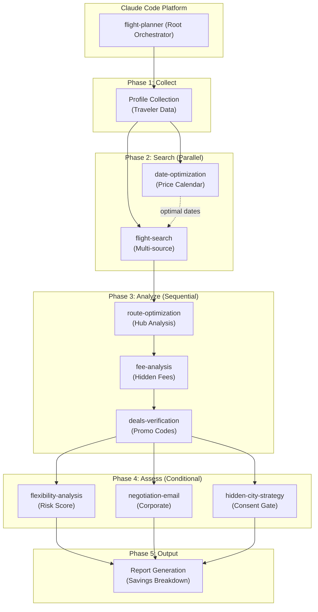
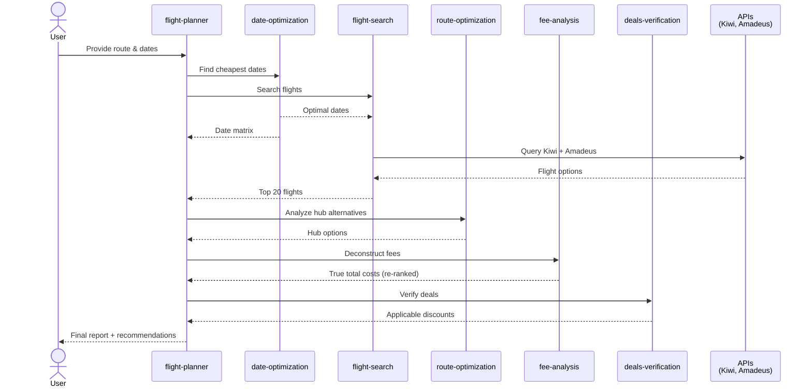
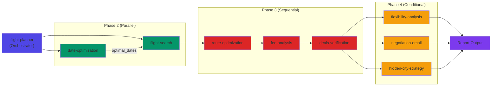

# System Architecture

## High-Level Overview

Travel Optimization Engine is a **modular skill orchestration system** built on Claude Code's plugin architecture. The root `flight-planner` skill orchestrates 8 specialized sub-skills across a 5-phase workflow to deliver comprehensive flight cost optimization.



## Component Architecture

### Root Orchestrator (flight-planner)

**File:** `SKILL.md`

**Responsibility:** Coordinate 5-phase workflow and delegate to sub-skills.

**Key Logic:**
1. Validate and normalize traveler profile
2. Dispatch Phase 1 (collect missing profile fields)
3. Launch Phase 2 skills in parallel (date-optimization + flight-search)
4. Sequence Phase 3 skills (route → fee → deals)
5. Conditionally trigger Phase 4 skills (flexibility, negotiation, hidden-city)
6. Assemble Phase 5 report

**Inputs:** User natural language + optional structured profile

**Outputs:** Final comparison report with recommendations

### Phase 2: Search Skills

#### date-optimization
- **File:** `skills/date-optimization/SKILL.md`
- **Purpose:** Analyze prices across flexibility window
- **Inputs:** Origin, destination, baseline date, flexibility (±5-14 days)
- **Process:**
  1. Generate date matrix for all dates in window
  2. Call Kiwi API or use AI-knowledge pricing patterns
  3. Identify cheapest date(s), price trends, savings
- **Outputs:** Ranked dates, savings vs baseline, trend analysis
- **Script:** `date_matrix.py` — Price calendar computation

#### flight-search
- **File:** `skills/flight-search/SKILL.md`
- **Purpose:** Multi-source flight search with virtual interlining
- **Inputs:** Origin, destination, dates, passengers, cabin_class
- **Process:**
  1. Query Amadeus (real-time, if API available)
  2. Query Kiwi Tequila (all options including LCC)
  3. Detect virtual interlining opportunities
  4. Merge and de-duplicate results
  5. Rank by price, then by convenience
- **Outputs:** Top 20 flights sorted by true_total
- **Script:** `parallel_search.py` — Parallel API coordination

### Phase 3: Analysis Skills

#### route-optimization
- **File:** `skills/route-optimization/SKILL.md`
- **Purpose:** Discover hub-based route alternatives
- **Inputs:** Flight options from flight-search
- **Process:**
  1. Identify major hubs (SFO, DFW, NRT, ICN, DUB, etc.)
  2. Search alternative routings via hubs
  3. Compare total cost vs direct
  4. Assess connection time and missed-connection risk
- **Outputs:** 2-3 hub alternatives with savings breakdown
- **Script:** `route_analyzer.py` — Hub routing analysis
- **Reference:** `hub-analysis.md` — Hub strategy database

#### fee-analysis
- **File:** `skills/fee-analysis/SKILL.md`
- **Purpose:** Deconstruct hidden fees and calculate true total
- **Inputs:** Flight options (advertised prices)
- **Process:**
  1. Look up airline fee matrix
  2. Calculate: taxes, baggage, seat selection, fuel surcharge, change fees
  3. Recalculate true_total for each option
  4. Re-rank options by true_total
  5. Identify fee avoidance strategies
- **Outputs:** Fee breakdown per option, re-ranked top 5, avoidance tips
- **Script:** `fee_calculator.py` — Fee computation engine
- **References:**
  - `airline-fee-matrix.md` — Airline-specific fees
  - `avoidance-strategies.md` — Fee avoidance tips

#### deals-verification
- **File:** `skills/deals-verification/SKILL.md`
- **Purpose:** Find and verify applicable promo codes and discounts
- **Inputs:** Route, airline(s), booking_type, dates
- **Process:**
  1. Query deal sources (airline websites, loyalty, flash sales, bank partnerships)
  2. Filter applicable deals based on route/airline/type
  3. Verify deal validity and expiry
  4. Calculate actual savings per deal
  5. Tag with confidence level (HIGH/MEDIUM/LOW/EXPIRED)
- **Outputs:** Applicable deals, instructions, savings per deal
- **Reference:** `deal-sources.md` — Deal database and sources

### Phase 4: Conditional Assessment Skills

#### flexibility-analysis
- **File:** `skills/flexibility-analysis/SKILL.md`
- **Purpose:** Refundable vs non-refundable risk assessment
- **Inputs:** Selected option, booking timeline, schedule certainty
- **Trigger:** User expressed schedule uncertainty OR risk_tolerance != conservative
- **Process:**
  1. Analyze fare rules for refundability
  2. Calculate change-fee costs
  3. Estimate probability of changes needed
  4. Break-even analysis: refundable vs non-refundable
  5. Generate risk score (0-100)
- **Outputs:** Risk assessment, refundable recommendation, break-even threshold
- **Reference:** `fare-class-rules.md` — Fare class flexibility rules

#### negotiation-email
- **File:** `skills/negotiation-email/SKILL.md`
- **Purpose:** Generate corporate discount negotiation emails
- **Inputs:** Corporate profile (volume, routes, preferred airlines)
- **Trigger:** booking_type == "corporate"
- **Process:**
  1. Generate email template with volume metrics
  2. Attach route concentration and competitor pricing data
  3. Create talking points and follow-up strategy
  4. Include sample deal packages
- **Outputs:** Email template, talking points, follow-up strategy
- **Reference:** `email-templates.md` — Template library

#### hidden-city-strategy
- **File:** `skills/hidden-city-strategy/SKILL.md`
- **Purpose:** Skiplagging analysis with full disclosure
- **Inputs:** Route, eligibility confirmation (explicit user consent required)
- **Trigger:** ONLY if user explicitly asks + passes eligibility check
- **Safety Gates:**
  - `disable-model-invocation: true` — Manual invocation only
  - Explicit consent required
  - Eligibility check (visa, luggage, connection time)
  - Full legal risk disclaimer
  - Enforcement tracking (airline bans, account closures)
- **Process:**
  1. Verify explicit user consent
  2. Check eligibility (visa, luggage rules, connection time)
  3. Search skiplagging options (via hidden city)
  4. Provide enforcement risk rating
  5. Full legal disclaimer
- **Outputs:** Hidden city options, enforcement risk, legal warning
- **References:**
  - `eligibility-check.md` — Eligibility criteria
  - `enforcement-levels.md` — Airline enforcement tracking

## Data Flow Architecture



## Skill Dependency Graph



## Shared Services Architecture

### Configuration Service

**File:** `scripts/config.py`

**Responsibility:** Centralized credential management

**Exports:**
```python
class APIConfig:
    kiwi_api_key: Optional[str]
    amadeus_api_key: Optional[str]
    amadeus_secret: Optional[str]

    def is_api_available() -> bool
```

**Used By:** All API client services

### Kiwi Tequila Client

**Files:**
- `scripts/kiwi_client.py` — Basic HTTP wrapper
- `scripts/kiwi_tequila.py` — High-level interface

**Responsibility:** Kiwi Tequila API integration

**Methods:**
- `search_flights(origin, dest, date, passengers)` → List[Flight]
- `search_routes(origin, dest, date)` → List[Route]
- `detect_interlining(flights)` → List[Interlining]
- `get_price_trends(route, days=30)` → PriceTrend

**Used By:** flight-search, date-optimization, route-optimization

### Amadeus Client

**File:** `scripts/amadeus_client.py`

**Responsibility:** Amadeus API integration (OAuth2)

**Methods:**
- `search_flights(origin, dest, date, passengers, cabin)` → List[Flight]
- `get_seat_map(flight_id)` → SeatMap
- `get_airline_rules(airline)` → AirlineRules
- `get_price_history(route, days=90)` → PriceHistory

**Used By:** flight-search, fee-analysis, route-optimization

### Price Normalization Service

**File:** `scripts/normalize.py`

**Responsibility:** Price calculation and normalization

**Functions:**
- `calculate_true_total(price, taxes, fees, baggage)` → float
- `breakdown_costs(total_price, airline)` → CostBreakdown
- `convert_currency(amount, from_curr, to_curr)` → float
- `calculate_savings(original, actual)` → Savings

**Used By:** fee-analysis, route-optimization, deals-verification, final report

## Reference Data Architecture

### Static References

| File | Type | Usage | Update Frequency |
|------|------|-------|------------------|
| `airport-codes.md` | Data | IATA validation, hub identification | Quarterly |
| `glossary.md` | Docs | Terminology definitions | Annually |
| `user-profile-schema.md` | Spec | Profile validation | Bi-annually |
| `hub-analysis.md` | Data | Hub routing analysis | Quarterly |
| `airline-fee-matrix.md` | Data | Fee calculation | Monthly |
| `fare-class-rules.md` | Data | Flexibility analysis | Quarterly |
| `enforcement-levels.md` | Data | Hidden city enforcement tracking | Monthly |

### API References

| File | Service | Update Frequency |
|------|---------|------------------|
| `amadeus-api.md` | Amadeus | As-needed (API changes) |
| `kiwi-api.md` | Kiwi Tequila | As-needed (API changes) |

### Dynamic Deal Sources

| Source | Type | Freshness |
|--------|------|-----------|
| Airline websites | Direct discounts | Daily |
| Flash sales | Flash deals | Real-time |
| Loyalty programs | Partner benefits | Daily |
| Bank partnerships | Cardholders | Daily |
| Travel agencies | Bulk discounts | Weekly |

## Two-Mode Architecture

### Mode 1: AI-Knowledge (Degraded Mode)

**When:** APIs not available or user prefers not to use them

**Capabilities:**
- Historical pricing patterns (from AI training data)
- Hub routing strategies (known patterns)
- Typical fee matrices (from research)
- Generic deal sources (public knowledge)

**Limitations:**
- Estimates only, not real-time
- Limited scope (major routes only)
- May not reflect current prices

**Advantage:** Works without any API keys

### Mode 2: API-Enhanced (Full Mode)

**When:** APIs configured (KIWI_API_KEY, AMADEUS_API_KEY set)

**Capabilities:**
- Real-time flight search (Kiwi + Amadeus)
- Current pricing and availability
- Virtual interlining detection
- Real-time deal verification
- Live price trends

**Limitations:**
- Depends on API uptime
- Subject to rate limits
- Prices may change at checkout

**Advantage:** Comprehensive, real-time, highest savings potential

**Fallback Logic:**
```
IF (api_key_configured AND api_response_success):
    use_real_time_data()
ELSE:
    use_ai_knowledge_fallback()
```

## Error Handling & Resilience

### API Error Handling

```
Timeout (>30s)          → Use AI-knowledge fallback
Connection Error        → Use cached data or fallback
Rate Limit (429)        → Exponential backoff + retry
Authentication (401)    → Log warning, use fallback
Server Error (5xx)      → Retry with backoff
Invalid Request (4xx)   → Log error, skip this source
```

### Graceful Degradation

```
Phase 2 Partial Failure:
  - If flight-search fails → Use date-optimization only
  - If date-optimization fails → Use baseline date with flight-search

Phase 3 Partial Failure:
  - If route-optimization fails → Skip hub alternatives
  - If fee-analysis fails → Use advertised prices
  - If deals-verification fails → Skip deals section

Phase 4 Partial Failure:
  - Individual skills failure doesn't block report output
```

## Security Architecture

### Credential Management

**Rule:** API keys NEVER in code

**Pattern:**
```python
import os

API_KEY = os.getenv("KIWI_API_KEY")  # Load from environment
if not API_KEY:
    logger.warning("API not configured")
    MODE = "ai_knowledge"
```

### Consent Gates

**Hidden City Strategy:**
1. User must explicitly ask ("Tell me about hidden city")
2. System confirms understanding of risks
3. User confirms eligibility (visa, luggage, time)
4. Only then proceed with analysis

**Virtual Interlining:**
1. Always warn about missed connection risk
2. Explain baggage rules
3. Suggest delay insurance

### Data Privacy

- No user data logged or stored
- Profile data used only for current session
- API responses not cached beyond session
- No analytics or tracking

## Extensibility

### Adding a New Skill

1. Create directory: `skills/new-skill-name/`
2. Add `SKILL.md` with frontmatter
3. Add `scripts/` folder if computation needed
4. Add `references/` folder with documentation
5. Link from root `SKILL.md` (Phase dispatch)
6. Update `project-roadmap.md`

### Adding a New API Source

1. Create `scripts/new_source_client.py`
2. Implement standard interface (search, parse, error handling)
3. Update `config.py` with credentials
4. Update relevant skills to call new source
5. Document in reference files

### Updating Reference Data

1. Edit reference file (e.g., `airport-codes.md`)
2. Verify changes are backward compatible
3. Update CHANGELOG.md
4. Test affected skills

## Deployment

### Installation

```bash
git clone https://github.com/phucsystem/claude-skill-flight-planner.git
claude --add-dir /path/to/repo
```

### Configuration

```bash
# Set API keys (optional)
export KIWI_API_KEY="..."
export AMADEUS_API_KEY="..."
export AMADEUS_API_SECRET="..."
```

### Verification

```bash
# Test root skill
/flight-planner HAN SFO 2026-06-15

# Test individual skills
/date-optimization HAN SFO 2026-06-15
/flight-search HAN SFO 2026-06-15
```

## Architecture Decisions

### Why Modular Skills?

- **Reusability:** Each skill works independently
- **Maintainability:** Changes isolated to specific skill
- **Composability:** Mix/match skills per user need
- **Scalability:** Easy to add new skills

### Why Sequential Phase 3?

- **Dependency:** Fee analysis needs flight results
- **Refinement:** Each step improves previous results
- **Clarity:** Linear process easier to follow and debug

### Why Conditional Phase 4?

- **Relevance:** Not all users need all skills
- **Performance:** Skip unnecessary computation
- **Customization:** User context determines which skills run

### Why Two Modes?

- **Accessibility:** Works without API keys
- **Resilience:** Falls back if APIs down
- **Choice:** Users control data source preference

## References

- `project-overview-pdr.md` — Requirements and specifications
- `code-standards.md` — Coding standards
- `project-roadmap.md` — Future architecture plans
- `README.md` — Getting started guide
